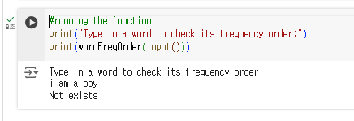
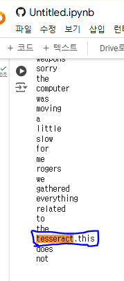
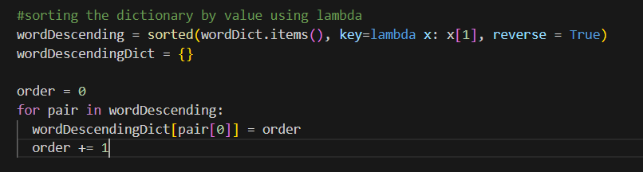
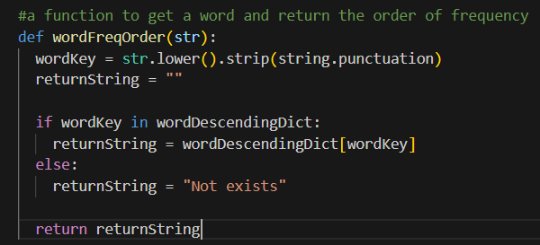
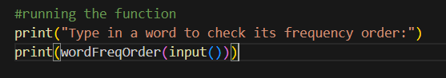

# AIFFEL Campus Online Code Peer Review Templete
- 코더 : 윤형석
- 리뷰어 : 안승보


# PRT(Peer Review Template)
- [X]  **1. 주어진 문제를 해결하는 완성된 코드가 제출되었나요?**
    - 
    - 문제에서 요구하는 사항에 맞게 'i am a boy'를 사용자가 입력하면 [2, 121, 3, 541]이라는 결과가 출력되게 만드시면 될 것 같습니다.
    - 
    - tesseract.this가 올바르게 전처리되지 않은 것 같습니다.
    - 요구사항에 맞게 코드 수정해서 다시 리뷰 요청해주시면 좋을 것 같습니다.
- [X]  **2. 전체 코드에서 가장 핵심적이거나 가장 복잡하고 이해하기 어려운 부분에 작성된 
주석 또는 doc string을 보고 해당 코드가 잘 이해되었나요?**
        
- [X]  **3. 에러가 난 부분을 디버깅하여 문제를 해결한 기록을 남겼거나
새로운 시도 또는 추가 실험을 수행해봤나요?**
    - sorted를 직접 구현하는 과정에서 무한 루프 에러가 발생함.
    - list 및 dict를 불필요하게 사용한 것 같다. => 요구사항에서 필요로 하는 dic, vocab만 잘 구현하셨고, 클래스를 사용하면 좀 더 깔끔하게 구현할 수 있을 것 같습니다.
        
- [X]  **4. 회고를 잘 작성했나요?**
    - 
        
- [X]  **5. 코드가 간결하고 효율적인가요?**
    - 
        - 해당 부분에서 order를 사용하지 않는 방법과 pair에 대한 설명이 명확하지 않은 부분을 수정하면 좋을 것 같습니다.
        - inline comment
        - 함수 및 변수명
        - # + space + comment
    - 
        - 사용자의 잘못된 입력을 고려해서 input에 대한 전처리를 진행하는 부분이 인상적입니다.
    - 
        - wordFreqOrder() 함수의 parameter가 str인데 함수를 넣어서 처리하는 부분에 대해 생각해보시면 좋을 것 같습니다. 


# 회고(참고 링크 및 코드 개선)
- https://peps.python.org/pep-0008/#inline-comments
```
# 리뷰어의 회고를 작성합니다.
# 코드 리뷰 시 참고한 링크가 있다면 링크와 간략한 설명을 첨부합니다.
# 코드 리뷰를 통해 개선한 코드가 있다면 코드와 간략한 설명을 첨부합니다.
```
